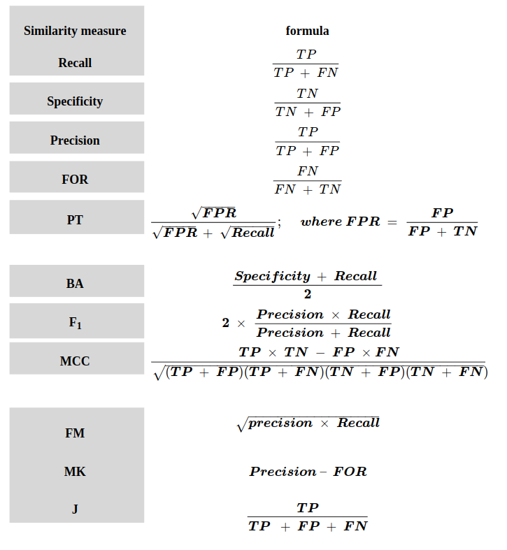

Author:	
		Seyed Naeim Moafinejad: snmoafinejad@iimcb.gov.pl
# 1D2DSimScore
# Table of contents
- [Functionality](https://github.com/Naeim-Moafi/1D2DSimScore#1-functionality)
- [Installation](https://github.com/Naeim-Moafi/1D2DSimScore#2-installation)
- [Usage](https://github.com/Naeim-Moafi/1D2DSimScore#3-usage)
- [The abbreviation of some of the scores](https://github.com/Naeim-Moafi/1D2DSimScore#4-the-abbreviation-of-some-of-the-scores)
- [How to use 1D2DSimScore as a first-time user](https://github.com/Naeim-Moafi/1D2DSimScore#how-to-use-1d2dsimscore-as-a-first-time-user)

# 1. Functionality
1D2DSimScore is a software to compare biomolecular structures with each other.

The software receives different types of inputs and compares structures in terms of secondary structure, different types of contacts between the residues, tertiary structure, and quaternary structure. 

1D2DSimScore can calculate various similarity and dissimilarity scores (e.g., MCC, F-score, J-index, etc.) based on their interaction maps using two different algorithms. One is a one-dimensional array or vector (1D) of interactions, and the other is a two-dimensional array or matrix (2D) of interactions. In the 1D algorithm for dot-bracket notation, each residue in the biomolecules can be involved in only one interaction (it is usually used for NA), and when comparing 3D structures, each edge (Watson-Crick, Hoogsteen, Sugar), and face (bottom and top faces in the case of stacking) of the nucleotide can be involved in only one interaction. In contrast, in the 2D algorithm, each nucleotide can be involved in multiple possible interactions. Although these two algorithms have their strengths and weaknesses, they complement each other in different analyses.

1D2DSimScore can be used in a variety of different projects to evaluate and analyze the results. Researchers can use 1D2DSimScore to compare different structures of a particular biomolecule (e.g., alone and in complex with another molecule of interest) to better understand its functional properties.

# 2. Installation
## Prerequisites
---
- g++ v11 (g++-11)
---
1D2DSimScore has several different modules that can be used separately.

For installation, you can use "install.sh" with the name of the module you want to install. 

You can install more than one package at a time. For that, you need to write the names of the packages and separate them with spaces.

	./install.sh 1D_01 2D_01_Dataset

Name of the modules:
- 1D_01
- 1D_01_Dataset
- 2D_01
- 2D_01_Dataset
- 2D_01_align
- 2D_01_CMO
- 2D_N
- 2D_N_Dataset

Or you can use the option "all" to install all the modules.

	./install.sh all

You can use install.sh with the option "clean" to uninstall the software.

	./install.sh clean

The requested module can also be found in the bin directory in case of adding environment variables to the user's bashrc from the 1D2DSimScore source directory.

After installation, you can go to the corresponding directory and use the samples to become familiar with the installed package and its features.

The installation can be done on Windows subsystem Linux (WSL) as well.

# 3. Usage

Different type of the interactions in 1D2DSimScore in case of inputs are nucleic acids
* c or C for canonical
* e or E for extended canonical (wobble (GU WW_cis) will be considered as canonical)
* n or N for noncanonical
* w or W for Wobbles (GU WW_cis)
* b or B for all type of the base pairs
* s or S for stacking (only for 2D_N)
* a or A for All type of possible interacrtions

If the inputs are not nucleic acids and type of interaction is required you can use a or A for all type of interactions comparison.

## 1D_01

calculates the similarity scores for binary format (positives "X" or "1" and negatives "." or "0").

Usage:

	./1D_01 -r <referenceFile.xo> -q <queryFile.xo> -b -o [outputName]

Example:

	./1D_01  -r samples/ref.xo -q samples/query.xo -b -o results/sampleTest.csv

## 1D_01_Dataset
calculates the similarity scores in a data set of binary format files and the output would be a matrix of requested scores in separate files.

Usage for 1D_01_Dataset with a file:
	
	./1D_01_Dataset -i <inputFile> -B -S <requested_scores_separated_with_comma> -o [outputName]

Example for 1D_01_Dataset with a file:
	
	./1D_01_Dataset -i samples/sample1.xo  -B -S MCC,Fscore,for,jInDeX -o results/test.gsm

for the output you specify the basename and extension of the outputs and software will make a name related to the score you requested.

Usage for 1D_01_Dataset with a folder:
	
	./1D_01_Dataset -i <inputFolder> -B -S <requested_scores_separated_with_comma> -o [outputName]

Example for 1D_01_Dataset with a folder:
	
	./1D_01_Dataset -i samples/XOs_dir  -B -S MCC,Fscore,for,jInDeX, JBINDEX -o results/test.gsm

In dataset comparison the default extension of the files for 1D_01_Dataset is ".xo" but in case the users have different extension, they can use option -e with extension, for instance, ".bin".

## 2D_01

calculates the similarity scores for dot-bracket notation format files.

In this module, you can calculate the scores with a one-dimensional (vector) or two-dimensional (matrix) algorithm for comparing structures.

** 1D algorithm is recommended when the residues are only involved in a single interaction or interactions are ordered in the way the one with higher probability (or any other weight) comes first. In this case only first one would be part of the comparison of the two structures.

Usage:
	
	./2D_01 -r <referenceFile.SS> -s [sequenceFile.seq] -q <queryFile.SS> -d <requested_interactions> --1D(or --2D) -o [outputName]

Example:

	./2D_01  -r samples/dotBracketRef.SS -q samples/dotBracketQuery.SS -s samples/SeqForDotBracket.seq -d enaw --1D -o results/sampleTest.csv Reference path: samples/dotBracketRef.SS

** without a sequence for type of interaction you can only request for a or A.

## 2D_01_Dataset

calculates the similarity scores in a dataset for dot-bracket notation format files.

In this module, you can calculate the scores with a one-dimensional (vector) or two-dimensional (matrix) algorithm for comparing structures.

Usage for 2D_01_Dataset with a file:

	./2D_01_Dataset -i <inputFile> -D -S <requested_scores_separated_with_comma> --1D (or --2D) -o [outputName]

Example for 2D_01_Dataset with a file:

	./2D_01_Dataset -i samples/AllInOne.SS_all  -D -S MCC,Fscore,for,jInDeX --2D -o results/test.gsm

Usage for 2D_01_Dataset with a folder:

	./2D_01_Dataset -i <inputFolder> -D -S <requested_scores_separated_with_comma> --1D (or --2D) -o [outputName]
	
Example for 2D_01_Dataset with a folder:

	./2D_01_Dataset -i samples/freeSL2  -D -S MCC,Fscore,for,jInDeX --2D -o results/test.gsm

In dataset comparison the default extension of the files for 2D_01_Dataset is ".SS" but in case the users have different extension, they can use option -e with extension, for instance, ".dbn".

## 2D_01_align

calculates the similarity scores (for alignment in a specific range) for dot-bracket notation format files.

Usage for 2D_01_align files:
	
	./2D_01_align -i <inputFile> -b <requested_interaction> -o outputName

Example:
	
	./2D_01_align -i samples/blast_example.txt -b can -o results/outputTest.csv

## 2D_01_CMO

calculates the similarity scores (for alignment in a specific range) for two maps directly (*_2.map from ContactExtractor is possible input of this module).

Usage for 2D_01_CMO:
	
	./2D_01_CMO -r <referenceFile> -q <queryFile> -o [outputName]

Example:
	
	./2D_01_CMO  -r samples/ref.map -q samples/query.map -o results/sampleTest.csv

## 2D_N

*For the time being only methods for the classification of interactions in nucleic acids are available. But if the user can provide the program with same format in "2D_N/samples" program can calculate the similarity scores with option "a" or "A".*

calculates the similarity scores for nucleic acid 3D structures. For how to provide input for this module or how to use [ClaRNA](http://iimcb.genesilico.pl/clarna/), you may want to contact Prof. Janusz Bujnicki.

In this type of the input you can use option --1D with different number of involved edges(W,S,H) and faces (><)
for determining the number of edges you want to be present in calculation of similarity scores you can choose one of the following options (1, 2, 3, or 5 edges and faces)

- Cans     --> 1, 3, or 5
- NonCans  --> 3 or 5
- Stacks   --> 2 0r 5
- Wobbles  --> 1, 3, or 5
- BasePairs--> 3 or 5
- All      --> 3 or 5
		 
Usage for clarna output files: 

	./2D_N -r <referenceFile.out> -q <queryFile.out> -p <pdbFile.pdb> -c <requested_interactions> --1D <number_of_involved_edges> -o [outputName]

Example: 

	./2D_N  -r samples/ClaRNARef.out -q samples/ClaRNAQuery.out -p samples/sample.pdb -c ebwn -o results/sample.csv --1D 3

*For nucleic acid we reduce interactions to 1D and in this case we can decrease the effect of the number of negatives for calculation of similarity scores, 2D algorithm would be avialable in the near future.*

***it is required to separate chains with "TER" keywords (in case of 1 chain you can use TER at the end before "END" keyword) and only one model in pdb format file***

## 2D_N_Dataset

calculates the similarity scores 2D_N_Dataset for RNA 3D structures.

Usage for 2D_N_Dataset files (all vs all): 
	
	./2D_N_Dataset -i <inputDirectory> -C <requested_interactions> --1D <number_of_involved_edges> -S <requested_scores_separated_with_comma> -o [outputName]

Example for 2D_N_Dataset files (all vs all): 
	
	./2D_N_Dataset -i samples/dir -C cansb --1D 5 -S fscore,mcc,mk,csi,jindex,recall -o results/sample_test.gsm

In dataset comparison the default extension of the files for 2D_N_Dataset is ".out" but in case the users have different extension, they can use option -e with extension, for instance, ".dbn".

***it is required to separate chains with "TER" keywords (in case of 1 chain you can use TER at the end before "END" keyword) and only one model in pdb format file***

**Notice  that in case of the division by zero in pairwise comparison the amount in the table would be "-". But for dataset comparison the amount in the matrices would be "-1.1".**

# 4. The abbreviation of some of the scores:

- **M**atthews **C**orrelation **C**oeficient (MCC)
- **J**accard **Index** (JIndex)
- **F**owlkes-**M**allows **Index** (FMIndex)
- **F**alse **O**mission **R**ate (FOR)
- **P**revalence **T**hreshold (PT)
- **C**ritical **S**uccess **I**ndex (CSI)
- **M**ar**K**edness (MK)
- **B**ujnicki **Index** (BIndex) or (JBIndex)

---
***You can find the sample of inputs and results in the corresponding directories.***

---
***How to use 1D2DSimScore as a first-time user***
---
1D2DSimScore includes several modules and offers users a wide range of metrics. It might be a bit too much for the first-time users who have no previous statistical knowledge. For this reason, we recommend that users use MCC as the default for the 1D algorithm and F1-score for the 2D algorithm. It is also recommended to use the 1D algorithm for nucleic acids and the 2D algorithm for other types of biomacromolecules and biomacromolecule complexes.

***For more information look at [Confusion matrix](https://en.wikipedia.org/wiki/Confusion_matrix)***

***To extract residues in contact with a specific distance, you can use the [ContactExtractor](https://github.com/Naeim-Moafi/1D2DSimScore/tree/master/ContactExtractor)***
